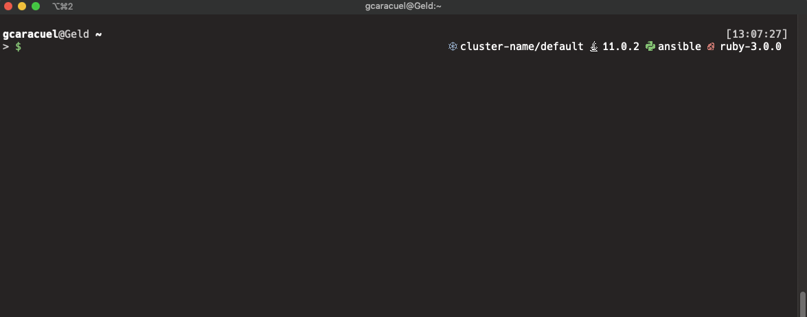
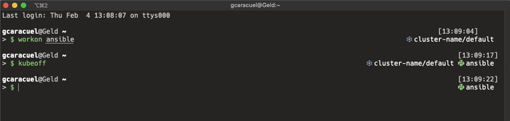

# Gaia ZSH Theme

A ZSH theme inspired by [bureau](https://github.com/isqua/bureau) & [bureau-env](https://github.com/angus-lherrou/bureau-env) but going further on environment integration, that's why this name.

Using Gaia you will have always in front of your eyes:
* Python virtualenv active
* Kubernetes active cluster and namespace (via [kubectx](https://github.com/ahmetb/kubectx))
* Ruby version and environment
* Java version 
* Ruby version

Recommende font: **Hack Nerd Font**

Of course git status fully integrated too

### Requirements

- [virtualenv](https://virtualenv.pypa.io/) & virtualenvwrapper
- [kubectx](https://github.com/ahmetb/kubectx
- Recomended: [nerd-fonts](https://www.nerdfonts.com/). Set a nerd font in your terminal for non ASCII chars.

### Configuration

- GAIA_THEME_NVM_SHOW=true|false to enable display/hide nvm active version
- GAIA_THEME_JAVA_SHOW=true|false to enable display/hide java version
-  GAIA_THEME_VENV_SHOW=true|false to enable display/hide Python virtualenv active environment
- GAIA_THEME_RUBY_SHOW=true|false to enable display/hide ruby active version
- GAIA_THEME_K8S_SHOW=true|false to enable display/hide Kubernetes active cluster and namespace (kubectx nd kubenv required)

Extras:
- KUBE_PS1_BINARY will be used to target kubectl location. Defaults to /usr/bin/kubectl
- Use command kubeon and kubeoff to enable disable Kuvbernetes prompt integration. This is useful when your k8s cluster is slow or timing out which will impact your shell performance.

---

---

